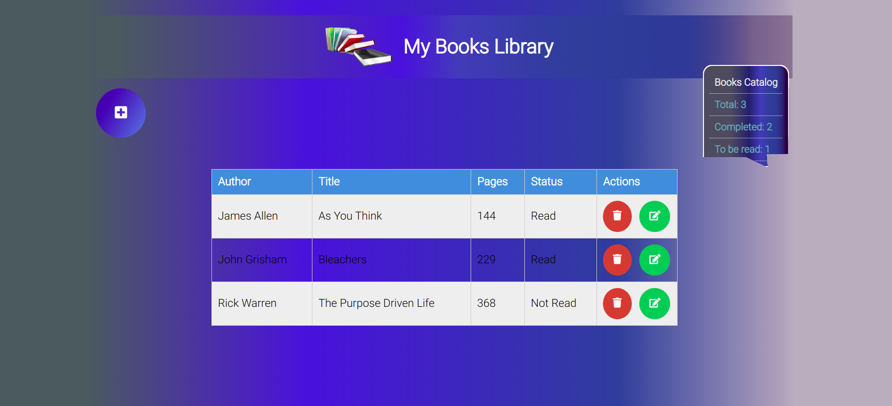
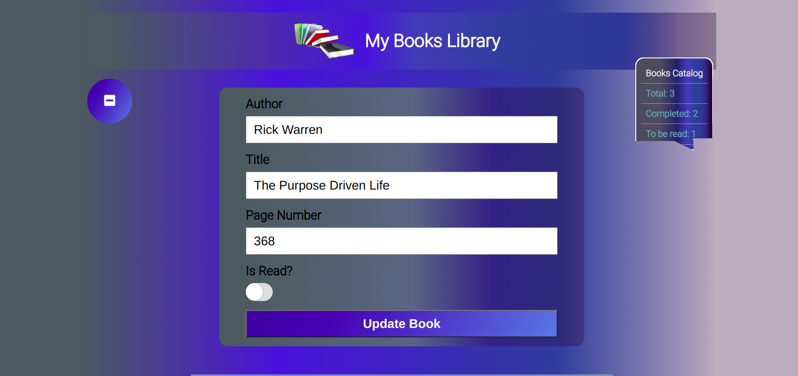

# Library JS

## Content

<a text-align="center" href="#about">About</a>&nbsp;&nbsp;&nbsp;|&nbsp;&nbsp;&nbsp;
<a href="#description">Description</a>&nbsp;&nbsp;&nbsp;|&nbsp;&nbsp;&nbsp;
<a href="#live">Live Demo</a>&nbsp;&nbsp;&nbsp;|&nbsp;&nbsp;&nbsp;
<a href="#screenshots">Screenshots</a>&nbsp;&nbsp;&nbsp;|&nbsp;&nbsp;&nbsp;
<a href="#with">Built with</a>&nbsp;&nbsp;&nbsp;|&nbsp;&nbsp;&nbsp;
<a href="#setup">Setup</a>&nbsp;&nbsp;&nbsp;|&nbsp;&nbsp;&nbsp;
<a href="#prerequisites">Prerequisites</a>&nbsp;&nbsp;&nbsp;|&nbsp;&nbsp;&nbsp;
<a href="#author">Author</a>

## About 

Library JS is a JavaScript project that stores typical book attributes as book author, book title, number of pages and whether a book is read or to be read by the end user. The goal is to showcase such JavaScript features as DOM Manipulation and Objects and Object constructors. Local storage is used to persist the data.

<h3>Description </h3>
<h4>This project allows a user to:</h4>
<li>Create a book item</li>
<li>Update a book item</li>
<li>Delete a book item</li>
<li>Persist book items using browser's localStorage</li>
<li>Show simple catalog of all the books in the localStorage</li>

## 🔴 Live Demo 

**Click [here](https://library-js-temesghen.netlify.app/) in order to see a Live Demo of this project.**

## Screenshots 

### Books List
 
### Update Book
 

## 🔧 Built with

- Vanilla JavaScript
- ES6
- HTML
- CSS
- ESLint
- StyleLint

## 🔨 Setup
### Run a Local Copy
- Download the repository to a local directory on your computer.
- Or run the following commands on the terminal
  - git clone https://github.com/temesghentekeste/library-js.git
  - cd library-js
  - open index.html file

## Prerequisites
- A modern up-to-date browser

## ✒️  Author 

👤 **Temesghen Tekeste**

- Github: [@temesghentekeste](https://github.com/temesghentekeste)
- Twitter: [@temesghentekes1](https://twitter.com/temesghentekes1)
- Linkedin: [temsghen tekeste](https://www.linkedin.com/in/temesghentekeste/)

## 🤝 Contributing

Contributions, issues and feature requests are welcome!

Feel free to check the [issues page](https://github.com/temesghentekeste/library-js/issues).

## 👍 Show your support

Give a ⭐️ if you like this project!

## :clap: Acknowledgements
- <a href="https://www.microverse.org/" target="_blank">microverse.org</a>
- <a href="https://netlify.com/" target="_blank">netlify</a>
- <a href="https://bennettfeely.com/clippy/" target="_blank">CSS clip-path maker</a>
- <a href="https://cssgradient.io/" target="_blank">CSS Gradient
</a>

